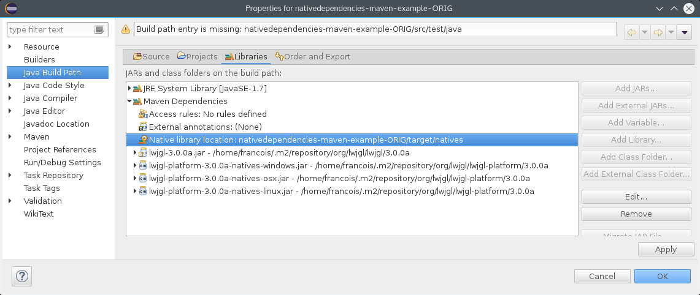

:toc: macro

image:https://travis-ci.org/fmarot/nativedependencies-maven.svg?branch=master["Build Status", link="https://travis-ci.org/fmarot/nativedependencies-maven"]

toc::[]

= What is nativedependencies-maven ?

== Maven plugin (nativedependencies-maven-plugin)

This Maven plugin will unpack the native dependencies (usually .so files on Linux, DLLs on Windows) into a single folder.

Those "native" dependencies are recognized thanks to the https://books.sonatype.com/mvnref-book/reference/profiles-sect-tips-tricks.html#profiles-sect-platform-classifier[Maven classifier] which *must* start with the "natives-" prefix.

If those artifacts are .zip, .tgz, .7z or any other recognized format, their content will be transparently extracted (optionnaly in different subdirectories) in target/natives/ directory.

By default, in case of a multi module project, we will unpack all natives dependencies to the same dir located at the root of the project
(thus saving space and unzip time while allowing all interdependent projects to benefit from the presence of native libs)

== Eclipse plugin (Eclipse M2E Extension)

In order to ease the development from within your Eclipse IDE, we have a plugin to automatically add the path to the "natives" directory to "Native library location" of the project (hence -Djava.library.path).

This plugin is an M2E extension that acts on Maven projects using the "nativedependencies-maven-plugin".
 

However, it currently does not set the LD_LIBRARY_PATH (on Linux) nor the PATH (on Windows) so native code trying to load it's own native dependencies will not work automagically.
In this case you'll have to set the variable before launching Eclipse.

== About the project

This is a fork of the previously existing https://code.google.com/p/mavennatives/[Maven Native Dependencies] project which was at version 0.0.7.

The maven plugin has then been renamed to "nativedependencies-maven-plugin" to follow Apache Maven conventions and groupId changed to "com.teamtter.mavennatives".

Big thanks to the original writers of Maven Native Dependencies.

Reasons for forking original project:

* add finer grain control over what natives dependencies will be unpacked.
* familiarize myself with the dev of Maven plugins.
* improve eclipse plugin (NOT done at the moment)
* finally find a way to prevent each and every project using native libs to have to manually (god I hate this word!) configure the -Djava.library.path and LD_LIBRARY_PATH

Current features added to original plugin:

* use GitHub instead of the dead Google Code 
* more modern code using annotations
* parameter to be able to skip the plugin execution (overridable through a variable)
* add parameters to auto-detect platform and get only platform specific libs
* transparently handle misc compression format (zip, tar, tgz, 7zip...) and single file not compressed deps (.dll, .so, .dylib...)
* keep a cache of the signature for each compressed artifact to avoid uncompressing it again if it has not changed. #performance

= How to use the Maven plugin

== Maven dependency

The plugin is available from Maven Central, just add the following snippet to your pom to use it:

[source,xml]
-------------------------------------------
<project>
	...
	<build>
		<plugins>
			<plugin>
				<dependency>
				    <groupId>com.teamtter.mavennatives</groupId>
				    <artifactId>nativedependencies-maven-plugin</artifactId>
				    <version>1.0.0</version>
				    <executions>
				<execution>
				...
				</executions>
				<configuration>
				...
				</configuration>
      		<plugin>
		...
-------------------------------------------
 
== Options
 
[source,xml]
-------------------------------------------
<plugin>
	<groupId>com.teamtter.mavennatives</groupId>
	<artifactId>nativedependencies-maven-plugin</artifactId>
	<version>1.0.0</version>
	<executions>
		<execution>
			<id>unpacknatives</id>
			<phase>generate-resources</phase>
			<goals>
				<goal>copy</goal>
			</goals>
		</execution>
	</executions>
	<configuration>
		<skip>false</skip>
		<autoDetectOSNatives>false</autoDetectOSNatives> <!-- if 'true' then you don't need the 'osFilters' list -->
														<!-- we advise you set 'autoDetectOSNatives' to true and forget about osFilters -->
		<!-- <nativesTargetDir>${session.executionRootDirectory}/target/natives</nativesTargetDir> -->
		<!-- <separateDirs>true</separateDirs> -->
		<osFilters>
			<osFilter>
				<osName>linux</osName>
				<osArch>64</osArch>
				<suffix>linux</suffix>
			</osFilter>
			<osFilter>
				<osName>windows</osName>
				<!-- <osArch>64</osArch> --> <!-- this line is not mandatory -->
				<suffix>win</suffix>
			</osFilter>
		</osFilters>
	</configuration>
</plugin>
-------------------------------------------

== Single module Maven project

TODO

== Multi module Maven project

By default, as you can see commented above (parameter 'nativesTargetDir'), the default directory will be "${session.executionRootDirectory}/target/natives".

This means that in a multi-module configuration, you can have all you native dependencies extracted alongside the main pom in ./target/natives.

This allows you to have a single location where are stored all your native libs, as long as you always run maven related commands *FROM THE ROOT DIRECTORY*.

If you want to target a specific child module, you can use the --projects parameter: mvn install --projects my-child-module

 
= How to use the Eclipse M2E extension

Point Eclipse to the following update site:

* https://dl.bintray.com/fmarot/com.teamtter.mavennatives.m2eclipse.natives.site/

= Getting help

You can ask questions on http://stackoverflow.com[StackOverflow] with the official tag http://stackoverflow.com/questions/tagged/nativedependencies-maven[#nativedependencies-maven]

The http://maven.40175.n5.nabble.com/Maven-Users-f40176.html[Maven Users mailing list] may also be a good start.

Or you can always https://github.com/fmarot/nativedependencies-maven/issues[open an issue] directly on Github. 

= Compiling the code

Commited code is compiled by https://travis-ci.org/fmarot/nativedependencies-maven/builds/[Travis-CI]

Eclipse's Tycho seem to require Java 8.

= License

Apache License 2.0 
